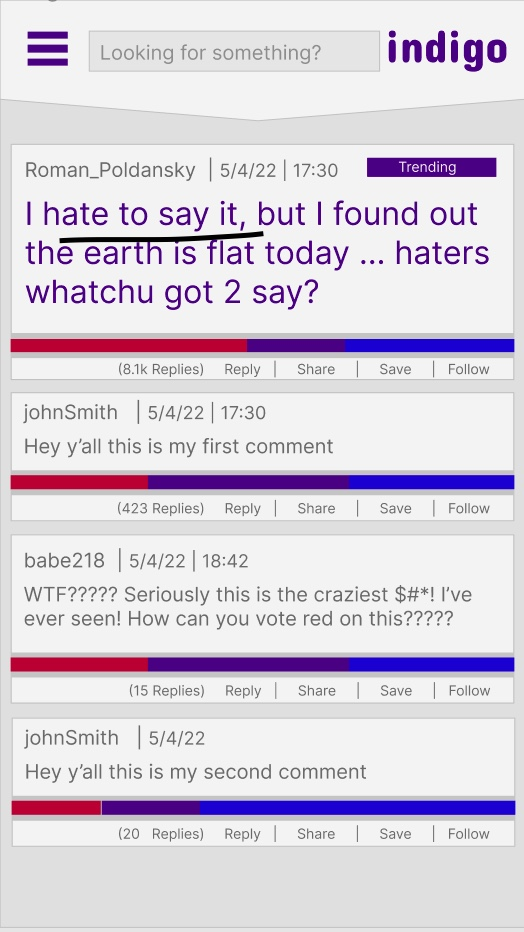

***
## Date: 05/05/2022

## By: Dylan Marvel

 ### [Github](https://github.com/marveldylan) | [Twitter](https://twitter.com/dmarv77) | [LinkedIn](https://www.linkedin.com/in/dylan-marvel/)
 ***

 ## ***DESCRIPTION***
 ### Indigo is a new social media app that combines user messaging threads with new polling technology to gauge popularity and facilitate discourse on topics, posts, and ideas. User posts support a wide variety of content including rich text, images, videos, and GIFs. Other users can view content and comment as normal, however instead of a like or dislike, users can choose one of three colors for a reaction; red, blue or indigo. Default parameters allow for red = negative response, blue = positive response, indigo = middle/wildcard, however the post can also specify a use case for each response. In turn, comments can also be voted upon, similar to Upvotes in Reddit. The number/percentage of each response is displayed as a bar underneath the post or comment with relative ratios of each color. Indigo features a mobile-first design and seeks to implement a fun and intuitive UI. Posts and comments will be sorted and searchable as most popular, along with most and least agreed. 
 &nbsp;

 ## ***Technologies***
 
 * JWT Authentication

## **Mobile Mockup**

## **Instructions for Developers (for local use)**
* Fork and clone this repo
* Navigate to project folder
  * client folder - install depencenies^ and enter npm run start in terminal
  * server folder - install dependencies^ and enter npm run dev in terminal
* Open index.html

* Front-end Dependencies:
   * npm i react-router-dom

*Back-end Dependencies:
   * npm i nodemon
   * npm i morgan
   * npm i express mongoose

  

## ***Future Updates***
- [X] ~~Submit README.md~~

### **CHECK OUT MORE ON [TRELLO](https://trello.com/invite/b/ytPCliNp/818f0103d877643543b2cb4d5d7c360f/indigo)**
### **LINK TO [ERD](https://lucid.app/lucidchart/d52c89be-274c-49a2-a998-12b30f9be04f/edit?invitationId=inv_5aed0518-81f5-45cc-bc83-b2e437e54d5c)**
### **LINK TO [React Component Hierarchy Diagram](https://lucid.app/lucidchart/900236fa-acaf-49f8-a4cd-2680e857449d/edit?invitationId=inv_fe35e785-473b-4115-aa9c-e860d0dc55c1)**
&nbsp;

## ***Credits***
### **ASSET MOCK-UPS BUILT WITH: [GRAVIT](https://www.designer.io/en/)**
### **ERD AND COMPONENT HIERARCHY DIAGRAM CREATED WITH: [Lucidchart](https://www.lucidchart.com/pages/)**
### **MERN Stack Image: [duckduckgo search](https://external-content.duckduckgo.com/iu/?u=https%3A%2F%2Fwww.cmarix.com%2Fblog%2Fwp-content%2Fuploads%2F2019%2F09%2FMern.jpg&f=1&nofb=1)**
